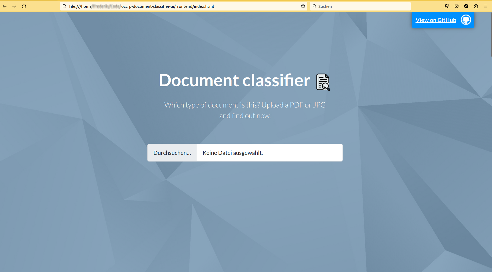

# README

# Set up
This is the graphical user interface for the [OCCRP document classifier](https://github.com/DSSGxDFKI/occrp-document-classifier).

A demo of this UI is hosted here: https://josemcorderoc.github.io/occrp-document-classifier-ui/. The demo only provides classification results of three example documents. The classification results are pre-computed as the machine learning model is not live. 

In order to run the actual model, clone this repo via `git clone https://github.com/josemcorderoc/occrp-document-classifier-ui.git`. Open `frontend/index.html` in a browser. It should look like this:

 

For setting up the backend to this, see [backend/README.md](https://github.com/josemcorderoc/occrp-document-classifier-ui/tree/main/backend).

## To Dos

- ~~Render prediction JSON (JM)~~
- ~~Clear button (JM)~~ 
- ~~Thumbnails (in JS) (Frederik)~~
- ~~progress circle thing~~
- ~~add table of results (datatables.net)~~
- ~~remove the white horizontal bar at the very top~~
- Validation of input (max size/num of pages/format)
- Write some things:
    - How to understand the thresholds, why sometimes all numbers are zero
    - CNN
    - Which classes do we distinguish
- test mobile version (at least the information should look more or less look okay)
- ~~set up Google Analytics.~~
- Add cookie banner and info on imprint page
- add imprint page
- add JPG support
- predicted other vs. predicted 0 have to be more clear in chart and bar chart
- columns in table and bar chart more clear
- when clicking on multiple Details, only one bar graph should be visible at one time
- design bar chart (probabilites in %, center bar chart)
- expand/collapse table has to be layouted (paddings) and is buggy at the moment, first time it doesn't collapse. When closed it should only read Expand, otherwise Collapse.
- result section should not be displayed in the beginning
- ~~probably add DSSG logo at the bottom~~
- add attribution (sources) of images everywhere, below the images or in the Imprint. links are in the css file
- contact: maybe adding a contact formular? or give out our e-mails, but then might need some spam protection

